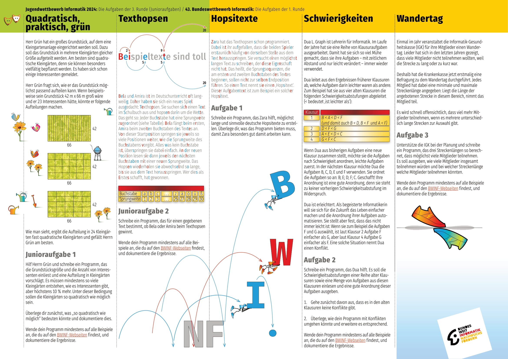

# BWINF-43
Lösungen vom TLS-Team zum Bundeswettbewerb Informatik 43 (BWINF 43).

# Projekte
[Aufgabe 3: Wandertag](./Wandertag/)

# Aufgaben

# Fortschritt
| Aufgaben         | Theorie          | Implementation              | Dokumentation  |
|------------------|------------------|-----------------------------|----------------|
| Junior Aufgabe 1 | Jan Niklas Seipp | Jan Niklas Seipp            | /              |
| Junior Aufgabe 2 | Louis Weigel     | Louis Weigel                | /              |
| Aufgabe 1        | /                | /                           | /              |
| Aufgabe 2        | David Noskov     | David Noskov                | /              |
| Aufgabe 3        | Daniel Hohmann   | Daniel Hohmann, Erik Donath | Daniel Hohmann |
| Aufgabe 4        | Luis Herr        | Luis Herr                   | /              |
| Aufgabe 5        | /                | /                           | /              |
