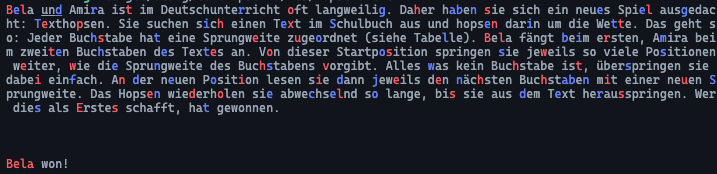
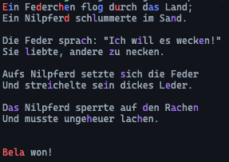
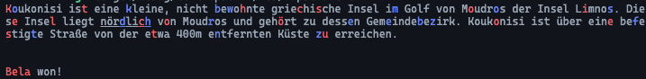

# Texthopsen

## Lösungsidee

Das Aufgabe ist, mit bestimmten Regeln durch einen Text zu "hopsen". Das heißt, man fängt bei einem Buchstaben an, zum Beispiel dem ersten, und je nach dem, wo er im Alphabet ist, geht man dann so viele Buchstaben weiter.  
Nun holt man sich einen Freund dazu uns macht daraus einen Wettbewerb indem der eine beim ersten und der andere beim zweiten Buchstaben anfängt. Die Person, die zuerst aus dem Text herausspringt, gewinnt.

Generell habe ich den Algorithmus nur einmal umgesetzt und dann mit verschiedenen Startpositionen aufgerufen.

### Index immer erhöhen

Meine erste Idee, die auch intuitiv sofort Sinn ergibt, war einfach einen index zu haben, den man immer um so viel erhöht, wie das nächste Zeichen entfernt war.  
Doch als erstes muss man alle Zeichen entfernen, die nicht mitgezählt werden, also alles außer `a-zäöüß`. Diesen neuen Text nennen wir jetzt "GText".

Man nimmt das Zeichen bei dem derzeitigen Index schaut in einer Tabelle nach, wie viele Stellen man jetzt "weiter hopsen" muss.
Diese Zahl fügt man dem Index hinzu und dann beginnt das wieder von vorne.
Jedes mal, wenn man hüpft, erhöht man eine Variable um eins und gibt die zurück, sobald der Index größer gleich als die Länge des GText ist.

Dann führt man das zweimal aus, immer mit der unterschiedlichen Startposition, und vergleicht am Ende die beiden zurückgegebenen Werte:  
Wenn beide gleich sind, hat niemand gewonnen, sonst der, mit dem kleineren Wert.

Man hat mit diesem Ansatz eine Zeitkomplexität von:

$$
O\left(n + \frac{m \cdot (m + 1)}{2}\right)
$$

`n` ist die Länge des originalen Textes und `m` die vom GText.

Warum das so ist und wofür wir das brauchen wird später nochmal wichtig.

### Einmal durch das ganze Array gehen

Die andere Möglichkeit ist, auf einmal durch alle Zeichen des Textes durchzugehen und dabei den derzeitigen Index und den des nächsten Zeichens, wo man hin springen muss, im Auge zu behalten. Wenn das derzeitige Zeichen nicht mitgezählt werden soll (alles außer `a-zäöüß`), gehen wir einfach zum nächsten ohne den Index zu erhöhen.

Wenn das Zeichen aber valide ist, gucken wir, ob der derzeitige Index und der des nächsten gesuchten Zeichens derselbe ist. Sobald das stimmt, schaut man in einer Tabelle nach, wie viele Zeichen man weiterspringen muss. Diese Zahl addiert man mit dem derzeitigen Index und man hat den des nächsten gesuchten Zeichens wieder.  
Schließlich erhöht man noch die Anzahl an insgesamten Sprüngen.

Dann beginnt man wieder von vorn und überprüft das wieder alles fürs nächste Zeichen.

Wenn man dann durch alle Zeichen einmal durchgegangen ist gibt man die Gesamtzahl an Sprüngen zurück.

Dann führt man das zweimal aus, immer mit der unterschiedlichen Startposition, und vergleicht am Ende die beiden zurückgegebenen Werte:  
Wenn beide gleich sind, hat niemand gewonnen, sonst der, mit dem kleineren Wert.

Hier ist die Zeitkomplexität:

$$
O\left(n\right)
$$

### Performance

Interessanterweise ist die zweite Variante um einiges performanter.  

Anfangs dachte ich, dass das indexieren um einiges performanter wäre.
Doch da hatte ich vergessen, dass der Text Unicode ist und nicht ASCII.
Unicode hat keine gleichbleibende Länge, weshalb für jeden Buchstaben an einem bestimmten Index immer wieder von vorne gezählt werden muss, statt dass man den Offset ausrechnen kann.  
Dadurch kommt dann auch diese komplexe Zeitkomplexität.

Bei der anderen Variante geht man halt nur einmal durch den Text und zählt alles mit.

Man könnte das ganze optimieren, indem man, sofern man davon ausgehen kann, dass er es ist, den Text is ASCII konvertieren (je nach Sprache, ein Array von u8/bytes).

## Umsetzung

Auf den ersten Lösungsansatz werde ich jetzt nicht mehr weiter drauf eingehen.

Ich fange mit einigen Vorbereitungen an:

-   ich setzte den Text auf die Kleinbuchstabenvariante
    ```rust
    let text = text.to_lowercase();
    ```
-   Danach initialisiere ich die vier Variablen `jumps` (Wert an Sprüngen), `jump_indices` (Eine Liste aller Indexe, wo hingesprungen wurde, irrelevant), `next_jump_index` (Index des nächsten Buchstaben, wo man hinspringen mus) und `current_index`. (Derzeitiger Index des Buchstaben im Text).

    ```rust
    let mut jumps = 0;
    let mut jump_letter_indices = Vec::new();

    let mut jump_index = start_index;
    let mut current_index = start_index;
    ```

Danach starte ich die for-Schleife und gehe durch jedes Zeichen durch:

```rust
for (letter_index, char) in text.chars().skip(start_index).enumerate() {
    // ...
}
```

Ich brauche den originalen Index nur für die Visualisierung, ist also im weiteren Verlauf irrelevant.

Als nächstes bekomme ich die theoretisch Sprungdistanz für den aktuellen Buchstaben und finde damit direkt raus, ob das Zeichen überhaupt gezählt wird. Wenn das nicht der Fall ist, überspringe ich es einfach, sonst geht es weiter. Als nächstes gucke ich, ob der derzeitige Buchstabe denn schon der nächste ist, wo hingesprungen werden soll.

```rust
next_jump_index += new_jump_distance.unwrap() + 1;
```

Wenn ja, wird der Index vom nächsten Sprungziel ausgerechnet und die Anzahl an Jumps wird um eins erhöht.

Abschließend wird noch der derzeitige Index erhöht.

Um dann rauszufinden, wer gewonnen hat, führt man das oben Beschriebene zweimal aus, einmal mit einem Startindex von 0 und einmal mit 1.  
Dann vergleicht man, ob Amira einen niedrigere Anzahl an Sprüngen hat, als Bela. Bei Ja, gewinnt sie, sonst Bela.

## Beispiele

1. **Input:**
   Bela und Amira ist im Deutschunterricht oft langweilig. Daher haben sie sich ein neues Spiel ausgedacht: Texthopsen. Sie suchen sich einen Text im Schulbuch aus und hopsen darin um die Wette. Das geht so: Jeder Buchstabe hat eine Sprungweite zugeordnet (siehe Tabelle). Bela fängt beim ersten, Amira beim zweiten Buchstaben des Textes an. Von dieser Startposition springen sie jeweils so viele Positionen weiter, wie die Sprungweite des Buchstabens vorgibt. Alles was kein Buchstabe ist, überspringen sie dabei einfach. An der neuen Position lesen sie dann jeweils den nächsten Buchstaben mit einer neuen Sprungweite. Das Hopsen wiederholen sie abwechselnd so lange, bis sie aus dem Text herausspringen. Wer dies als Erstes schafft, hat gewonnen.
   **Output:**
   
2. **Input:**
   Ein Federchen flog durch das Land;
   Ein Nilpferd schlummerte im Sand.

    Die Feder sprach: "Ich will es wecken!"
    Sie liebte, andere zu necken.

    Aufs Nilpferd setzte sich die Feder
    Und streichelte sein dickes Leder.

    Das Nilpferd sperrte auf den Rachen
    Und musste ungeheuer lachen.
    **Output:**
    

3. **Input:**
   Koukonisi ist eine kleine, nicht bewohnte griechische Insel im Golf von Moudros der Insel Limnos. Diese Insel liegt nördlich von Moudros und gehört zu dessen Gemeindebezirk. Koukonisi ist über eine befestigte Straße von der etwa 400m entfernten Küste zu erreichen.
   **Output:**
   

## Quelltext

```rust
fn main() {
    let text = //...

    let bela_result = jump(&text, 0);
    let amira_result = jump(&text, 1);

    if amira_result.0 < bela_result.0 {
        println!("{} won!", "Amira".blue());
    } else {
        println!("{} won!", "Bela".red());
    }
}

fn jump(text: &str, start_index: usize) -> (usize, Vec<usize>) {
    let text = text.to_lowercase();

    let mut jumps = 0;
    let mut jump_letter_indices = Vec::new();

    let mut next_jump_index = start_index;
    let mut current_index = start_index;

    for (letter_index, char) in text.chars().skip(start_index).enumerate() {
        let new_jump_distance = JUMPING_DISTANCES.find(char);

        if new_jump_distance.is_none() {
            continue;
        }

        if current_index == next_jump_index {
            jump_letter_indices.push(letter_index + start_index);

            next_jump_index += new_jump_distance.unwrap() + 1;
            jumps += 1;
        }

        current_index += 1;
    }

    (jumps, jump_letter_indices)
}
```

